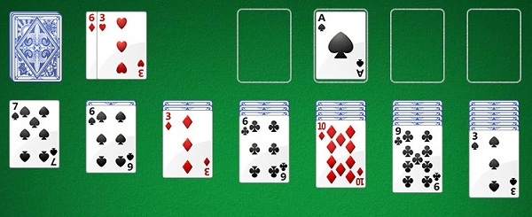

# Solitaire

## User story
User presented with loading screen with green felt background image and a centered start button
When the button is pressed, shuffle and deal from a deck of face down playing cards, stacking into standard 7 pile klondike setup
Including the 4 empty piles for the successfully ordered cards

User can click the deck to get a new card dealt.  cards dealt but not used are put on the bottom of the deck
When a card is used, the card most recently discarded to the bottom of the deck reappears in the dealt position

User can interact with cards by clicking on them.  this highlights the card border green.  Clicking on a card not in a bottom position
will select and highlight that card and all cards beneath it in the stack.  Clicking on another stack in the game board selects a move target, 
and the game checks for move legality.  illegal moves cause the selected card stack to briefly flash red indicating an illegal move.

The game ends when all cards are sorted successfully into the 4 sorted piles at the top of the game board, or when the user concedes the game

## Basic Design
Standard game of solitaire, modeled on the classic windows XP Klondike solitaire app

## MVP features:
* draw 1
* card stacks
* 2 click movement (1 click to select a card/card stack, a second click to select a destination)
* basic solitaire functionality
* reset game

## Icebox Features: (I think I'll have time to implement all of these and more)
* click and drag movement
* auto finish completed games
* [unnecessary, replaced by css:hidden] ~~face down pile cards suit and number doesnt exist until flipped (prevents cheating by inspecting)~~

